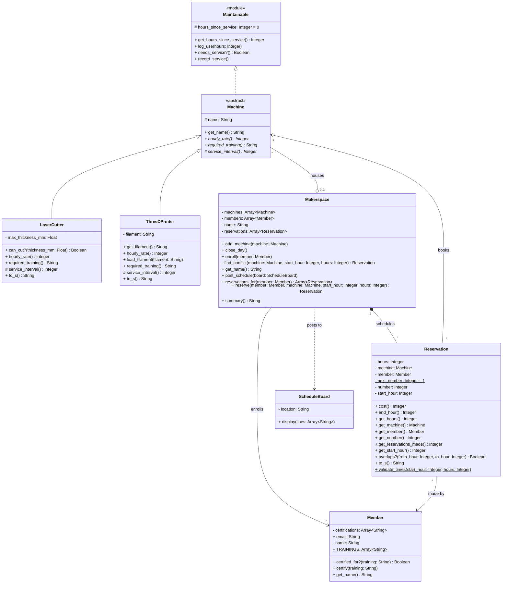

# Makerspace Reservations: Class Diagram

The team's agreed design. GitHub draws the diagram below from its Mermaid source; `class-diagram.png` is the same diagram as an image.

## Reading the Mermaid source

- A `$` after a member marks it class-level; the drawn diagram shows it underlined.
- A `*` after a method marks it abstract; the drawn diagram shows it in italics. Every subclass must define it.
- `Array~String~` is drawn as `Array<String>`: an array of strings.
- `<<module>>` marks a Ruby module, and `<<abstract>>` a class that is never created itself, only its subclasses.
- A name in capitals is a constant: `TRAININGS` in `Member` is `Member::TRAININGS`.
- Inside each class, attributes and methods are each listed in alphabetical order.
